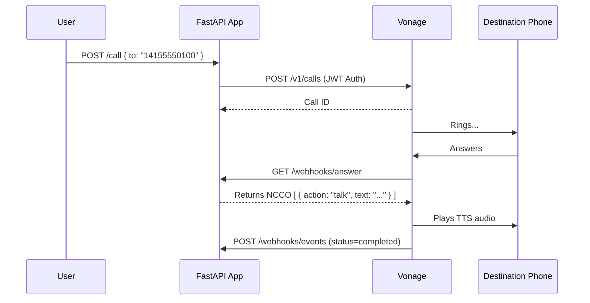

# Phase 1: Basic Call

This is Phase 1 of the AI Voice Calling Agent project. The goal of this phase is to establish the foundation of the FastAPI application and create outbound phone calls using the Vonage Voice API.

## Features
- Create outbound call endpoint (`/call`)
- Authenticate with Vonage using JWT
- Configuration via environment variables
- Simple NCCO (Talk action) provided via webhook
- Health check endpoint
- Structured logging

## Folder Structure
```
phase-01-basic-call/
├── src/
│   ├── api/
│   │   └── routes.py         # FastAPI endpoints (health, call, webhooks)
│   ├── services/
│   │   └── vonage_service.py # Vonage API interaction and JWT generation
│   ├── config.py             # Environment variable management
│   ├── logger.py             # Structured logging setup
│   └── models.py             # Pydantic schemas
├── tests/                    # Unit and integration tests
├── .env.example              # Environment variables template
├── Dockerfile                # Docker container configuration
├── main.py                   # FastAPI application entry point
├── README.md                 # This file
└── requirements.txt          # Python dependencies
```

## Flow Explanation
1. User sends a `POST /call` request with a destination phone number.
2. The FastAPI app generates a Vonage JWT using the App ID and Private Key.
3. The app sends a request to the Vonage Voice API to initiate a call.
4. Vonage calls the destination number.
5. When the user answers, Vonage requests the `answer_url` (webhook).
6. The FastAPI app responds with an NCCO containing a `talk` action, playing a synthetic voice message.
7. Call events (ringing, answered, completed) are sent to the `event_url` and logged by the app.

## Sequence Diagram


## Setup Guide

### 1. Prerequisites
- Python 3.12+
- Docker (optional)
- A Vonage Developer Account (https://developer.vonage.com/)
- Ngrok (or similar) to expose local server for webhooks

### 2. Configure Vonage
1. Create a Vonage Application in the dashboard.
2. Generate a public/private key pair. Save `private.key` in the `phase-01-basic-call` folder.
3. Purchase a Vonage number and link it to your application.
4. Set your application webhooks (requires running ngrok):
   - Answer URL: `https://<your-ngrok-url>/webhooks/answer` (GET)
   - Event URL: `https://<your-ngrok-url>/webhooks/events` (POST)

### 3. Local Setup
```bash
python -m venv venv
source venv/bin/activate
pip install -r requirements.txt
cp .env.example .env
```
Edit `.env` with your Vonage credentials.

### 4. Running the Application
```bash
uvicorn main:app --reload
```
Or with Docker:
```bash
docker build -t voice-agent-phase-01 .
docker run -p 8000:8000 --env-file .env voice-agent-phase-01
```

## Example API Requests

### 1. Health Check
```bash
curl http://localhost:8000/health
```

### 2. Make an Outbound Call
```bash
curl -X POST http://localhost:8000/call \
     -H "Content-Type: application/json" \
     -d '{"to_number": "14155550100"}'
```

## Troubleshooting
- **Vonage API returns 401 Unauthorized**: Check your `VONAGE_APPLICATION_ID` and ensure the `VONAGE_PRIVATE_KEY_PATH` points to a valid private key.
- **Webhooks not triggering**: Ensure your ngrok tunnel is running and the Vonage Application dashboard is configured with the correct URLs.

## Future Improvements
- Replace simple Talk action with WebSocket audio streaming (Phase 2).
